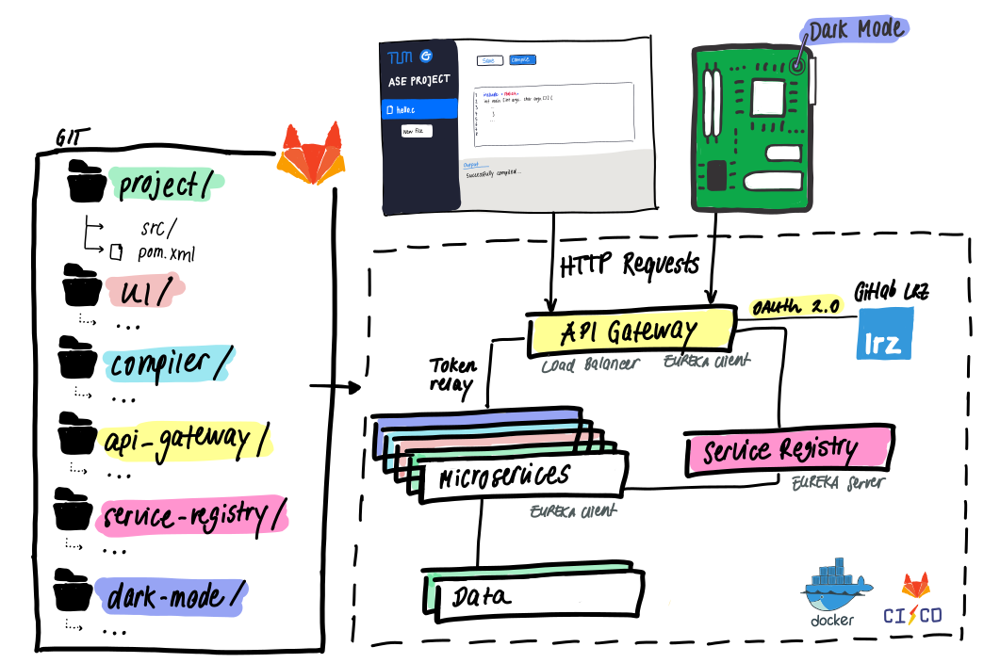

# OnlineIDE - Group 1-7
Developed for Advanced Topics of Software Engineering (TUM). Implemented by Group 1-7: Fami Mahmud, Anna Kovaleva, Jonas Großmann, Malte Radmann and Oliver Klukas

## Specification & Deliverables
- Current status: https://docs.google.com/document/d/19OIRA-nlSyDV6Gg2yM9lRUbJD9GPZsPHtaBsCV6S7uA/edit

- Final Report: https://docs.google.com/document/d/1C-g2RpuIxY3Kd1iKbYeaf2UM7BkCIWvteONAxZ_xrkA/edit

- Documentation to run & deploy OnlineIDE :
    - local: run the commands `mvn package -DskipTests` & `docker-compose up` in root of the project and navigate to localhost:80
        -   If you are a Linux User, it is necessary to install docker compose in addition to docker. Please follow the installation guide on 
            https://docs.docker.com/compose/install/ . Linux also requires to prefix the docker commmands with `sudo` .
        -   Redirect URL from Gitlab LRZ will not work as it points to IP of our Google Vm, need to contact Fami Mahmud
        -   Tested on Ubuntu 20.04 and Mac OS. 
    - deploy: run the complete CI/CD pipeline
        -   need to specify where the IDE should be deployed to in the .gitlab.ci yml file, currently specified to deploy to the running Google VM

- Deployed IDE URL: http://34.69.193.177

## Project Plan

